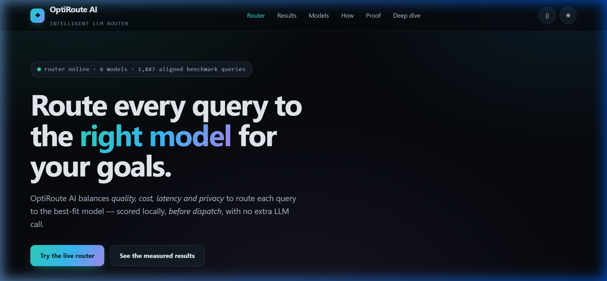
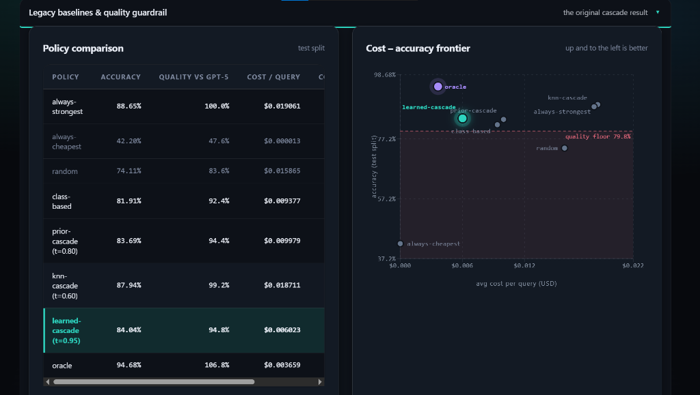
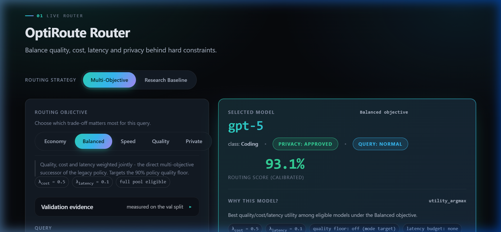

# ⚡ OptiRoute AI

### Intelligent LLM Routing for Quality, Cost, Latency & Privacy

**Choose the right model for every query — instead of sending every query to the most expensive model.**

<br/>

[](tests/)
[](requirements.txt)
[](webapp/server.py)
[](webapp/frontend/)
[](LICENSE)

<br/>

## 🏆 94.8% of GPT-5 Quality · 68.4% Lower Cost

**Measured on a frozen 282-query held-out test set.**

</div>

---

## 🎯 What is OptiRoute?

LLMs have very different **quality, cost, latency, and deployment constraints**.

A difficult reasoning query may justify GPT-5. A simpler query may be answered well by a much cheaper model.

**OptiRoute learns these trade-offs and makes the routing decision before inference.**

Instead of:

```text
Every Query → GPT-5
```

OptiRoute does:

```text
                         ┌─ Cheap model
                         │
Query → OptiRoute Router ├─ Mid-tier model
                         │
                         └─ Strong model
```

**The core goal is:**

> Use the cheapest model that can still satisfy the application's requirements.

$$\text{Quality} \;\longleftrightarrow\; \text{Cost} \;\longleftrightarrow\; \text{Latency} \;\longleftrightarrow\; \text{Privacy}$$

<br/>

<div align="center">
  
  <p><em>① Main Dashboard: Live intelligent routing across 8 production LLMs before inference dispatch.</em></p>
</div>

---

## 🚀 Why It Matters

On our sealed test set:

| Policy | Accuracy | Cost / Query | Cost Reduction |
|---|:---:|:---:|:---:|
| Always GPT-5 | 88.65% | $0.019061 | — |
| Always cheapest | 42.20% | $0.000013 | 99.9% |
| **OptiRoute learned cascade** | **84.04%** | **$0.006023** | **68.4%** |

That means OptiRoute retained:

**94.8% of GPT-5 quality while cutting inference cost by 68.4%.**

The router itself runs locally and adds approximately **11 ms median routing overhead**, without making an additional LLM/API call.

---

## 🔬 Research Behind the Router

OptiRoute was built from a measured model benchmark rather than assumed model rankings.

### Benchmark
- **8 LLMs**
- **1,887 benchmark queries**
- **26 benchmark sources**
- **5 capability classes**
- **15,096 query × model evaluations**
- Correctness, cost, and latency measured for every pair

The Phase-2 evaluation uses a stratified split:

```text
1,322 train
   ↓
  283 validation
   ↓
  282 sealed test
```

The sealed test split remains untouched during model fitting and threshold selection.

---

## 🧠 How Routing Works

OptiRoute performs the routing decision entirely before calling the selected model.

```text
                    OFFLINE
              Research / Training
                       │
                       ▼
          Query × Model Benchmark
                       │
                       ▼
              Train / Val / Test
                       │
                       ▼
              Quality Scoring
                       │
                       ▼
                Frozen Weights
                       │
                       ▼
                    ONLINE
                 Serving Time
                       │
                       ▼
                    Query
                       │
                       ▼
              Feature Extraction
                       │
                       ▼
              8 Model Quality Scores
                       │
              ┌────────┴────────┐
              ▼                 ▼
        Legacy Cascade      MO Selection
        Cost + Quality      Quality + Cost
                           + Latency + Privacy
              │                 │
              └────────┬────────┘
                       ▼
                 Selected LLM
```

### Online Decision

The router extracts a fixed 2,066-dimensional feature vector:
- **5 text statistics**
- **5 capability-class features**
- **2,048 hashed character n-gram features**
- **8 class-prior features**

Eight lightweight logistic scoring heads estimate how suitable each model is for the query.

The legacy policy evaluates models from cheapest to strongest:

```python
for model in cheapest → strongest:
    if score(model) >= threshold:
        select model
        stop

fallback → GPT-5
```

No model API is called to make the routing decision.

---

## 🏆 The Research Baseline

The validated research baseline optimizes:

> **Cost subject to a quality floor.**

The quality floor was defined relative to the strongest always-on policy.

### Sealed Test Result

$$\mathbf{84.04\%\; \text{accuracy}} \quad\text{vs.}\quad \mathbf{88.65\%\; \text{always GPT-5}}$$

while reducing cost by:

$$\mathbf{68.4\%}$$

This is the primary benchmark result.

---

## 📊 Baseline Comparison

| Policy | Accuracy | Quality vs GPT-5 | Cost / Query | Cost Cut |
|---|:---:|:---:|:---:|:---:|
| Always GPT-5 | 88.65% | 100.0% | $0.019061 | 0.0% |
| Always cheapest | 42.20% | 47.6% | $0.000013 | 99.9% |
| Random | 74.11% | 83.6% | $0.015865 | 16.8% |
| Class-based | 81.91% | 92.4% | $0.009377 | 50.8% |
| Prior cascade | 83.69% | 94.4% | $0.009979 | 47.6% |
| kNN cascade | 87.94% | 99.2% | $0.018711 | 1.8% |
| **OptiRoute learned cascade** | **84.04%** | **94.8%** | **$0.006023** | **68.4%** |
| Hindsight oracle | 94.68% | 106.8% | $0.003659 | 80.8% |

<br/>

<div align="center">
  
  <p><em>③ Sealed-Test Research Results: Policy comparison and Cost–Accuracy Frontier proving 68.4% cost reduction while clearing the 90% quality floor.</em></p>
</div>

### The Important Trade-off

The kNN baseline reaches higher accuracy, but gives up almost all of the cost savings.

OptiRoute instead finds a substantially cheaper operating point while remaining above the predefined quality floor.

The hindsight oracle establishes the remaining headroom available from perfect per-query model knowledge.

---

## 🤖 The Model Landscape

The benchmark exposed a large spread between models:
- **~51 percentage points in accuracy**
- **~6,200× in measured cost**
- **~55× in measured latency**

| Model | Accuracy | Cost / Query | Latency |
|---|:---:|:---:|:---:|
| Llama-3.1-8B-Instruct | 37.31% | $0.000013 | 0.31 s |
| Qwen3-8B | 76.68% | $0.000807 | 3.67 s |
| deepseek-v3-0324 | 75.73% | $0.000841 | 2.92 s |
| gemini-2.5-flash | 76.10% | $0.003463 | 0.19 s |
| gpt-4.1 | 72.39% | $0.004097 | 1.04 s |
| claude-sonnet-4 | 75.09% | $0.009877 | 0.33 s |
| gemini-2.5-pro | 87.44% | $0.082901 | 1.90 s |
| gpt-5 | 88.77% | $0.021178 | 0.81 s |

The important observation is:

> **There is no single model that dominates every objective.**

---

## 🌐 Multi-Objective Router

The benchmark baseline answers:
*How cheaply can we maintain acceptable quality?*

Real deployments may ask different questions:
- How fast can we respond?
- How much can we save?
- How much quality can we afford?
- Can sensitive requests stay on approved local models?

OptiRoute therefore includes a **Multi-Objective Router**.

It uses the same learned model-quality scores and adds:
- Cost weighting
- Latency weighting
- Quality constraints
- Latency budgets
- Privacy eligibility
- Pareto analysis
- Per-query explainability

<br/>

<div align="center">
  
  <p><em>② Multi-Objective Routing Decision: Dynamic utility optimization across Quality, Cost, Latency, and Privacy constraints.</em></p>
</div>

---

## ⚙️ Routing Modes

| Mode | Main Goal | Accuracy | Cost Cut | Key Benefit |
|---|---|:---:|:---:|---|
| **Economy** | Minimize cost | 80.85% | 82.5% | Maximum savings |
| **Balanced** | General trade-off | 86.17% | 14.7% | Strong quality/speed balance |
| **Speed** | Minimize latency | 77.30% | 84.1% | 0.5s p95 |
| **Quality** | Maximize quality | 86.52% | -146.5% | 97.6% GPT-5 quality |
| **Private** | Restrict sensitive traffic | 74.82% | 96.0% | 75% privacy-filtered |

These are measured operating points, not marketing labels.

No single mode dominates every metric. That is intentional.

---

## 🔒 Privacy-Aware Routing

Privacy is implemented as a **hard eligibility constraint**.

A deterministic local sensitivity classifier first checks the query.

For sensitive traffic:

```text
Sensitive Query
      │
      ▼
Local Sensitivity Check
      │
      ▼
Privacy Policy
      │
      ├── External models → blocked
      │
      └── Approved local models
                │
                ▼
          Model Selection
```

The privacy filter is applied before utility ranking. Therefore an external model cannot win simply because it has a higher quality score.

> **Important:** local routing does not make an externally hosted model private. Privacy is enforced by restricting which models are eligible for sensitive requests.

---

## 📐 Pareto Analysis

The benchmark also revealed an important result:

**5 of 8 models are globally non-dominated.**

The legacy router concentrates primarily on Qwen3-8B and GPT-5.

This is not a failure to use all eight models. It is a consequence of the measured model landscape: several mid-tier models do not provide a sufficiently attractive combination of quality and cost for the baseline objective.

We deliberately report this rather than forcing artificial model diversity.

---

## 🧪 Verification

The repository contains **130 automated tests** covering the research-to-serving path.

Key guarantees include:
- Frozen research result parity
- Deterministic routing
- 2,066-dimensional feature consistency
- Correct cascade stopping
- GPT-5 fallback behavior
- API backward compatibility
- Input validation
- Performance bounds
- Privacy filtering order
- Pareto frontier correctness
- Multi-objective constraint enforcement
- Batch/single-query consistency

### Frozen-result parity

The deployed router reproduces the research result:
- **Accuracy:** 84.04%
- **Cost/query:** $0.006023
- **GPT-5 quality:** 94.8%

The test suite fails if these values drift beyond the declared tolerance.

---

## ⚡ Performance

The routing decision itself is lightweight:

| Metric | Measured |
|---|---|
| Router p50 | 11.4 ms |
| Router p95 | 24.1 ms |
| Router p99 | 27.4 ms |
| Memory growth / 100 requests | +0.11 MB |
| Per-request weight reload | None |

Routing requires no additional LLM inference call and no network dependency.

Model inference latency is separate and depends on the selected model.

---

## 🎯 Difficulty Analysis

Difficulty tiers are derived from cross-model agreement:
- **Easy:** 6–8 models correct
- **Medium:** 3–5 models correct
- **Hard:** 0–2 models correct

| Policy | Easy | Medium | Hard |
|---|:---:|:---:|:---:|
| Always GPT-5 | 99.48% | 85.19% | 32.35% |
| Always cheapest | 54.64% | 18.52% | 8.82% |
| Class-based | 96.91% | 72.22% | 11.76% |
| kNN cascade | 99.48% | 81.48% | 32.35% |
| OptiRoute | 98.45% | 77.78% | 11.76% |
| Oracle | 100.00% | 100.00% | 55.88% |

### Honest Limitation

**111 queries are unsolvable by all eight models.**

A router cannot recover quality that does not exist anywhere in the model pool.

This is why the oracle and difficulty analysis are included: they quantify the remaining headroom instead of hiding it.

---

## 🧬 Research Integrity

The evaluation pipeline separates training, validation, and final evaluation:

```text
TRAIN
  ↓
Fit heads
Calibrate
Measure normalization statistics
  ↓
VALIDATION
  ↓
Tune thresholds
Verify quality floors
  ↓
SEALED TEST
  ↓
Final reporting only
```

The sealed test split is not used to tune the routing policy. A duplicate-ID audit is also included in the pipeline.

---

## 🚀 Quickstart

### Backend

```bash
git clone https://github.com/abdul-raheem-fast/OptiRoute-AI.git
cd OptiRoute-AI

pip install -r requirements.txt

python -m webapp.export_weights
python -m webapp.server
```

The API starts at:
```text
http://127.0.0.1:8317
```

Interactive API documentation:
```text
http://127.0.0.1:8317/api/docs
```

### Frontend Development

```bash
cd webapp/frontend

npm install
npm run dev
```

The production frontend can also be served directly by the backend when the built dashboard is present.

---

## 🔌 API

### Route a query
`POST /api/route`

Supports both:
- Legacy cost/quality routing
- Multi-objective routing

### Additional endpoints:
- `GET  /api/objectives`
- `GET  /api/pareto`
- `GET  /api/privacy`
- `POST /api/sensitivity`
- `GET  /api/results`
- `GET  /api/models`
- `GET  /api/modes`
- `GET  /api/scenarios`
- `GET  /api/stats`
- `GET  /health`

---

## 🖥️ Dashboard

OptiRoute includes a React + TypeScript dashboard for exploring the routing system.

The dashboard exposes:
- **Route Arena** — inspect individual routing decisions
- **Multi-Objective Playground** — switch objectives and constraints
- **Cost / Quality / Latency / Privacy** — explore trade-offs
- **Results & Quality Guardrail** — inspect frozen benchmark results
- **Evidence Lab** — inspect split and leakage evidence
- **Business Impact** — estimate savings at different traffic volumes
- **Operations** — inspect routing telemetry
- **Model Pool** — compare the eight models
- **How It Works** — inspect the routing architecture

> **Visual Walkthrough:**
> 1. **What is it?** → [Main Dashboard Overview](figures/screenshots/dashboard_overview.png)
> 2. **How does it work?** → [Multi-Objective Routing Decision](figures/screenshots/mo_routing_decision.png)
> 3. **Does it actually work?** → [Frozen Research Results & Frontier](figures/screenshots/research_results.png)

See [DEMO_SCRIPT.md](DEMO_SCRIPT.md) for the presentation walkthrough.

---

## 💰 Business Impact

The value of routing grows with query volume.

For applications sending millions of requests, even a fraction of a cent saved per request can become a significant infrastructure cost difference.

OptiRoute allows teams to choose an operating point based on their actual requirements:

```text
             QUALITY
                ▲
                │       Quality
                │
                │   Balanced
                │
                │
                │ Economy
                │
                └──────────────────►
                  COST / LATENCY
```

The system is therefore not tied to a single "best" model or a single fixed optimization target.

---

## 🔬 Reproducing the Research

The complete Phase-2 pipeline can be regenerated with:

```bash
python -m routing.run_all
```

Fast mode:
```bash
python -m routing.run_all --fast
```

Resume from a specific stage:
```bash
python -m routing.run_all --from 4
```

Multi-objective calibration and evaluation:
```bash
python -m routing.tune_mo
python -m routing.eval_mo
```

Raw benchmark data is intentionally excluded from Git because of its size.

The repository contains the source code, configuration, figures, frozen artifacts, documentation, and evaluation pipeline supporting the reported methodology.

---

## 📋 Research Questions

| Question | Finding |
|---|---|
| How much cost can be removed while maintaining a quality floor? | 68.4% reduction at 94.8% GPT-5 quality |
| What is the achievable ceiling? | 94.68% oracle accuracy |
| How do baselines compare? | Learned routing provides the strongest cost reduction among floor-meeting baselines |
| Where does routing struggle? | Hard queries |
| How much headroom remains? | 10.64 accuracy points between router and oracle |
| Can objectives beyond cost be exposed? | Yes — cost, quality, latency and privacy |

---

## ⚠️ Limitations

We intentionally report the limitations:
- The router has a 10.64-point oracle gap.
- Hard queries remain difficult.
- 111 queries are unsolvable by all eight models.
- The default legacy policy prioritizes cost/quality rather than latency.
- Free-form out-of-distribution prompts are routed conservatively.
- Self-hosted models are accounted for at zero direct API cost; their compute cost is not modeled.
- The privacy classifier is deterministic and local, but privacy enforcement ultimately depends on deployment policy.
- The Multi-Objective Router uses declared objective weights rather than learning those weights automatically.
- The benchmark represents a fixed model pool and dataset distribution; production traffic may differ.

These limitations are part of the research result, not hidden failure cases.

---

## 🏁 The Core Idea

There is no universally best LLM.

The right model depends on:

> **what the query asks · how much quality is required · how much latency is acceptable · how much the request can cost · whether the data can leave the deployment**

OptiRoute turns those trade-offs into an explicit, measurable routing decision.

- *Don't ask:* "Which LLM is best?"
- *Ask:* **"Which LLM is best for this query, under my constraints?"**

---

## 📁 Repository

```text
OptiRoute-AI/
├── routing/              # Research + multi-objective routing
├── webapp/               # API + dashboard
├── tests/                # 130-test verification suite
├── scripts/              # Benchmark provenance
├── figures/              # Research figures
├── docs/                 # Research documentation
├── references/           # Reviewed papers
├── models_registry.json  # Model configuration
├── run_eval.py           # Evaluation harness
└── DEMO_SCRIPT.md        # Presentation walkthrough
```

---

## 📄 License

[MIT](LICENSE) © OptiRoute AI contributors