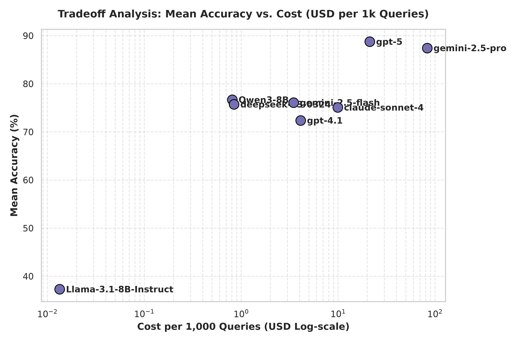

<div align="center">

# OptiRoute AI
### Intelligent LLM Router — send every query to the cheapest model that can still answer it well


**94.8% of flagship quality at 68.4% lower cost** — measured on a frozen held-out
test split of 282 real benchmark queries, with the hindsight oracle ceiling at
80.8% cost reduction on the same split. Now with an **experimental multi-objective
router** that trades quality, cost, latency *and* privacy per query.

[Results](#headline-results-frozen-held-out-test-split) ·
[Multi-objective](#multi-objective-routing-experimental) ·
[Live demo](#live-demo-dashboard--routing-api) ·
[How routing works](#how-routing-actually-works) ·
[API](#api-reference) ·
[Tests](#verification-130-automated-correctness-tests) ·
[Reproduce](#reproducing-the-research)

</div>

---

## TL;DR

Frontier LLMs are excellent and expensive. Small models are nearly free and
*usually* fine. OptiRoute AI decides, **per query and before any model is
called**, which one to use.

- **The evidence base.** 8 state-of-the-art LLMs were run over **1,887 queries**
  drawn from **26 benchmark sources** consolidated into **5 capability classes**,
  under a single query-aligned schema that records correctness, cost and latency
  for every (query, model) pair — 15,096 measurements in total.
- **The method.** One binary logistic-regression head per model predicts
  *P(this model answers this query correctly)* from the query text alone. A
  cheap-to-strong cascade then walks the pool and stops at the first model whose
  predicted probability clears a threshold `t*` tuned on a validation split under
  an explicit quality floor.
- **The result (test split, 282 queries, never used for training or tuning).**
  **84.04%** accuracy vs **88.65%** for always-strongest — that is **94.8%** of
  flagship quality — at **$0.006023 per query instead of $0.019061**, a **68.4%**
  cost cut.
- **The delivery.** A FastAPI routing service plus a React dashboard that
  explains every single decision. The deployed router scores queries from
  exported weights — **no API keys, no live model calls, no network dependency**.
- **The proof.** A 130-test correctness suite verifies that the deployed router
  reproduces the frozen research numbers *exactly*, and pins its behaviour on
  adversarial inputs, free text, batch paths, latency and memory.
- **The multi-objective extension (experimental).** A second router scores each
  model by a utility that blends **calibrated quality, cost and latency**, then
  applies **hard privacy and latency constraints before selection**. Five
  objective presets (Economy / Balanced / Speed / Quality / Private) let an
  operator pick a point on the trade-off surface. The legacy cascade stays the
  production default because it wins overall quality-per-dollar; the
  multi-objective router is exposed as an opt-in advanced mode.

> **The one-line thesis:** cost is the objective, quality is the constraint —
> and, in the experimental mode, latency and privacy are constraints too.

---

## The problem, and why a benchmark came first

Routing research is easy to fake and hard to trust: pick a threshold, tune on the
same data you report, quote a cost saving that assumes the cheap model was right.
So this project built the ground truth first and treated the router as a
hypothesis to be falsified against it.

Three properties make the evaluation honest:

1. **Real outcomes, not proxies.** Every number comes from measured
   correct/incorrect labels with measured per-query cost and latency — no
   simulated scores.
2. **A sealed test split.** 1,887 queries were stratified by
   `capability class x difficulty tier` into train 1,322 / val 283 / test 282
   (seed 42). The threshold `t*` was tuned on **val only**; the headline numbers
   come from **test only**; the leakage audit confirms the 246 duplicate query
   ids present in the extended 7-model set appear in **zero** val/test rows.
3. **An explicit quality floor.** A router only counts if it keeps at least 90%
   of always-strongest accuracy (`A_min = 79.8%` on test). Cheaper-but-worse
   policies are reported as failures, not wins.

111 queries are answered incorrectly by **all eight** models — they are kept in
the data, because pretending otherwise would inflate every policy including the
oracle.

---

## Headline results (frozen, held-out test split)

282 queries, seed 42, stratified. Every row below is regenerated from artifacts
by `python -m routing.run_all`; nothing is hand-edited.

| Policy | Accuracy | Quality vs strongest | Avg cost / query | Avg latency | Cost cut vs strongest | Meets floor | Oracle gap |
|---|---:|---:|---:|---:|---:|:---:|---:|
| always-strongest (GPT-5) | 88.65% | 100.0% | $0.019061 | 0.763 s | 0.0% | Yes | 6.03 pts |
| always-cheapest | 42.20% | 47.6% | $0.000013 | 0.311 s | 99.9% | **No** | 52.48 pts |
| random | 74.11% | 83.6% | $0.015865 | 1.369 s | 16.8% | **No** | 20.57 pts |
| class-based | 81.91% | 92.4% | $0.009377 | 3.654 s | 50.8% | Yes | 12.77 pts |
| prior-cascade (t = 0.80) | 83.69% | 94.4% | $0.009979 | 2.799 s | 47.6% | Yes | 10.99 pts |
| kNN-cascade (t = 0.60) | 87.94% | 99.2% | $0.018711 | 0.819 s | 1.8% | Yes | 6.74 pts |
| **learned-cascade (t\* = 0.95) — ours** | **84.04%** | **94.8%** | **$0.006023** | 3.490 s | **68.4%** | **Yes** | 10.64 pts |
| oracle (hindsight upper bound) | 94.68% | 106.8% | $0.003659 | 0.602 s | 80.8% | Yes | — |

**How to read it.** The learned cascade is the *only* floor-meeting policy that
beats 50% cost reduction. The kNN cascade buys +3.9 accuracy points over ours but
keeps just 1.8% of the savings — it pays for quality with almost the entire
budget. The oracle row is not achievable by any real system (it reads the answer
key); it exists to size the remaining headroom: **10.64 points**.

Full-data oracle sweep (`alpha = 0.002` over `cost + alpha x latency`, all 1,887
queries): **94.12%** accuracy vs **88.77%** always-strongest, at **80.7%** cost
reduction.

### Accuracy by difficulty tier

Tiers are derived from cross-model agreement: *easy* = 6-8 of 8 models correct,
*medium* = 3-5, *hard* = 0-2.

| Policy | Easy | Medium | Hard |
|---|---:|---:|---:|
| always-strongest | 99.48% | 85.19% | 32.35% |
| always-cheapest | 54.64% | 18.52% | 8.82% |
| class-based | 96.91% | 72.22% | 11.76% |
| kNN-cascade | 99.48% | 81.48% | 32.35% |
| **learned-cascade (ours)** | **98.45%** | **77.78%** | **11.76%** |
| oracle | 100.00% | 100.00% | 55.88% |

The hard tier is where routers separate: nothing but the oracle does well there,
because 111 queries are unsolvable by the whole pool. Our router gives up the
most exactly where the ceiling is lowest — an honest, quantified weakness rather
than a hidden one.

### The model landscape (all 1,887 queries, per model)

| # | Model | Provider | $ / 1M in · out | Accuracy | Avg cost / query | Avg latency |
|---:|---|---|---|---:|---:|---:|
| 1 | Llama-3.1-8B-Instruct | Meta / self-hosted | 0 · 0 | 37.31% | $0.000013 | 0.31 s |
| 2 | Qwen3-8B | Alibaba / self-hosted | 0 · 0 | 76.68% | $0.000807 | 3.67 s |
| 3 | deepseek-v3-0324 | DeepSeek AI | 0.27 · 1.10 | 75.73% | $0.000841 | 2.92 s |
| 4 | gemini-2.5-flash | Google DeepMind | 0.30 · 2.50 | 76.10% | $0.003463 | 0.19 s |
| 5 | gpt-4.1 | OpenAI | 2.00 · 8.00 | 72.39% | $0.004097 | 1.04 s |
| 6 | claude-sonnet-4 | Anthropic | 3.00 · 15.00 | 75.09% | $0.009877 | 0.33 s |
| 7 | gemini-2.5-pro | Google DeepMind | 1.25 · 10.00 | 87.44% | $0.082901 | 1.90 s |
| 8 | gpt-5 | OpenAI | 1.25 · 10.00 | 88.77% | $0.021178 | 0.81 s |

The spread the router has to exploit: **~6,200x** in cost, **~55x** in latency,
**51.4 points** in accuracy — and the cheapest model is *not* the worst on every
class, which is precisely why per-query routing beats any static choice.

Two things this table makes obvious, and that we do not hide:

- Cascade order follows the declared price ladder in `routing/config.py`;
  measured per-query cost can disagree with it (gemini-2.5-pro answers are much
  longer on this benchmark, so its measured cost exceeds GPT-5's). The
  *confidence gate*, not the order, decides where a query lands.
- **Latency is not the objective.** The learned cascade averages 3.49 s vs 0.76 s
  for always-strongest, because cheap self-hosted models are slower per query
  even though they cost ~nothing. If your product is latency-bound, run
  `mode=economy` or tune `alpha` in the oracle sweep — the dashboard reports
  latency alongside cost so this trade-off is always visible.



### Multi-objective router vs the legacy cascade (same sealed test split)

The experimental multi-objective router was evaluated on the **identical** 282-query
sealed test split, against the two fixed baselines and the legacy cascade. Regenerate
with `python -m routing.eval_mo`; every number below is read from
`routing/results/mo_eval_report.csv`.

| Policy | Accuracy | Quality vs GPT-5 | Avg cost | Cost cut | Avg latency | p95 latency | Privacy-filtered |
|---|---:|---:|---:|---:|---:|---:|---:|
| always-cheapest (Llama) | 42.20% | 47.6% | $0.000013 | 99.9% | 0.311 s | 0.945 s | 0.0% |
| always-GPT-5 | 88.65% | 100.0% | $0.019061 | 0.0% | 0.763 s | 1.042 s | 0.0% |
| **legacy cascade (t\* = 0.95)** | **84.04%** | **94.8%** | **$0.006023** | **68.4%** | 3.490 s | 13.036 s | 0.0% |
| MO · Economy | 80.85% | 91.2% | $0.003334 | 82.5% | 2.401 s | 11.299 s | 0.0% |
| MO · Balanced | 86.17% | 97.2% | $0.016260 | 14.7% | 0.624 s | 1.025 s | 0.0% |
| MO · Speed | 77.30% | 87.2% | $0.003038 | 84.1% | **0.164 s** | **0.507 s** | 0.0% |
| MO · Quality | 86.52% | 97.6% | $0.046992 | −146.5% | 1.615 s | 5.981 s | 0.0% |
| MO · Private | 74.82% | 84.4% | $0.000759 | 96.0% | 3.832 s | 14.048 s | **75.0%** |

**How to read it — honestly.** No single mode dominates. The legacy cascade still
offers the best overall quality-per-dollar (94.8% quality at 68.4% cut), so it
remains the **production default**. The multi-objective modes each buy something the
legacy router cannot: **Speed** cuts p95 latency from 13.0 s to 0.5 s; **Private**
routes 75% of sensitive traffic to local-only models; **Economy** pushes the cost cut
to 82.5%; **Quality** reaches 97.6% of GPT-5 (at a *negative* saving — it is a
quality-maximising, not cost-saving, mode and is labelled as such).

**Per-model mix on the test split** — this is the concrete evidence that the
multi-objective router genuinely diversifies beyond the legacy binary
Qwen/gpt-5 collapse:

| Policy | Model mix (% of test queries) |
|---|---|
| legacy cascade | Qwen3-8B 49.6 · gpt-5 50.4 |
| MO · Economy | Qwen3-8B 41.1 · gpt-4.1 39.0 · gemini-2.5-flash 18.4 · deepseek 1.4 |
| MO · Balanced | gpt-5 51.8 · gpt-4.1 39.0 · gemini-2.5-flash 9.2 |
| MO · Speed | gemini-2.5-flash 99.6 · gemini-2.5-pro 0.4 |
| MO · Quality | gpt-5 38.7 · gemini-2.5-pro 31.2 · gpt-4.1 28.4 · Qwen3-8B 1.8 |
| MO · Private | Qwen3-8B 92.6 · Llama-3.1-8B 7.4 |

The legacy router collapses to two models not because of a bug but because on this
benchmark no mid-tier model is both cheaper *and* better than the Qwen/gpt-5 pair on
any query — a **sparse Pareto frontier**, documented under
[Limitations](#honesty-notes-and-limitations).

---

## Live demo: dashboard + routing API

A self-contained service: FastAPI backend, React 18 + TypeScript + Vite +
Recharts frontend, and an **offline** router that scores queries from exported
weights.

### Quickstart (backend only — no Node, no API keys)

```bash
git clone https://github.com/abdul-raheem-fast/OptiRoute-AI.git
cd OptiRoute-AI
pip install -r requirements.txt

python -m webapp.export_weights   # trains the heads + tunes t*, writes routing/models/router_weights.npz
python -m webapp.server           # http://127.0.0.1:8317
python -m webapp.smoke_test       # endpoint self-check (server must be running)
```

`webapp/export_weights.py` needs the benchmark data (see
[Data policy](#data-policy)). If `webapp/frontend/dist` exists — and it is
committed, ~611 KB — the server serves the React dashboard; otherwise it falls
back to the legacy vanilla dashboard in `webapp/static/` so the API keeps working
on any checkout.

### Frontend development

```bash
cd webapp/frontend
npm install
npm run dev      # Vite dev server; proxies /api and /health to :8317
npm run build    # tsc --noEmit && vite build  ->  webapp/frontend/dist
```

### What the dashboard shows

| # | Section | What it proves |
|---:|---|---|
| 1 | **Route arena** | A live decision for one query: chosen model, per-model *P(correct)* bars, an animated cheap-to-strong cascade walk, a derived complexity estimate, an explainable *why this route* list, and the always-GPT-5 alternative with the exact per-query saving. Three routing modes and a **Challenge the router** button. The scenario chips are **real test-split benchmark queries** with their measured outcome attached. |
| 2 | **Multi-objective router** *(experimental)* | The MO playground: a five-mode objective selector (Economy / Balanced / Speed / Quality / Private), a sensitivity control (auto / normal / sensitive), a **latency-budget** slider and a **quality-floor** slider. The live decision shows the **calibrated routing score**, selected model, privacy status, an estimated cost and latency (split into router overhead vs model inference vs end-to-end), a human-readable reason, and a full per-model comparison table. Falls back to a clear "artifact not built" state if `mo_objectives.json` is absent. |
| 3 | **Cost ↔ quality ↔ latency ↔ privacy** | The measured **Pareto frontier** scatter (X = cost on a log scale, Y = quality, bubble size = latency, green ring = privacy-approved local model), the sealed-test trade-off table across every policy and mode, and the administrator privacy metadata with a **live deterministic sensitivity classifier**. |
| 4 | **Results + quality guardrail** | The frozen policy table above, the cost/accuracy frontier, and a floor-vs-current guardrail that fails loudly if quality ever drops below `A_min`. |
| 5 | **Evidence Lab** | The splits manifest (seed, per-stratum counts, duplicate-id leakage audit) and strongest / OptiRoute / oracle comparison cards. |
| 6 | **Business impact** | Daily, monthly and yearly savings at any query volume, with a "what the savings buy" breakdown. |
| 7 | **Operations** | Live session telemetry: escalation rate, model and tier mix, cumulative savings sparkline, labelled demo-vs-session data. |
| 8 | **Model pool** | The 8-model landscape with pricing, measured accuracy per capability class, cost and latency. |
| 9 | **How it works** | The architecture, the feature vector and the cascade, drawn from the same code the server runs. |

A narration-ready walkthrough lives in [`DEMO_SCRIPT.md`](DEMO_SCRIPT.md).

---

## How routing actually works

Two layers, strictly separated. **Offline** research produces weights;
**online** serving consumes them.

```
        OFFLINE (research, reproducible)                ONLINE (serving, ~11 ms)
  cleaned/aligned_8_models/*.csv                 query text  (+ optional class)
            |                                            |
   A1 build_matrix.py  ->  query x model            featurize(): 2,066 dims
        outcomes, cost, latency                     [5 scalars | 5 class one-hot
            |                                        | 2,048 hashed char-4-gram
   U1/U3 splits.py -> stratified train/val/test       TF-IDF | 8 class priors]
        + difficulty tiers                                 |
            |                                        8 logistic heads
   A3 learned_router.py -> one binary head            p_m = sigmoid(x . w_m + b_m)
        per model, t* tuned on VAL                         |
            |                                        cascade, cheapest -> strongest
   export_weights.py -> router_weights.npz  ------>   first p_m >= t wins,
        (W, b, idf, priors, registry,                 else FALLBACK to gpt-5
         t_star, mode table)                                 |
                                                      decision + reasons + savings
```

### The decision rule

1. **Featurize** the query into a fixed **2,066**-dimensional vector: 5 text
   scalars, a 5-way capability-class one-hot, 2,048 hashed signed char-4-gram
   TF-IDF features (md5-hashed, train-learned IDF, L2-normalised), and 8
   per-class prior accuracies. Hashing means the vector never grows with
   vocabulary and unseen words degrade gracefully.
2. **Score** all 8 heads: `p_m = P(model m answers correctly | query)`.
3. **Walk the cascade** in the configured cheap-to-strong order and stop at the
   **first** model with `p_m >= t`.
4. **Fall back** to the strongest model (gpt-5) if nothing clears the bar.
   Escalation is the safe default: an uncertain query buys quality, never a
   coin flip on a cheap model.
5. **Explain**: chosen model, full probability vector, the cascade trace with
   per-step pass/fail, a derived complexity tier, human-readable reasons, and the
   saving versus always-strongest.

If the caller supplies no capability class, the router infers one from the text
deterministically — the same query always yields the same route, bit for bit.

### Routing modes are threshold policies, not labels

Each mode is a real operating point, measured on the **same validation split**
used to tune `t*` (so the cards quote honest numbers, not marketing):

| Mode | Threshold `t` | Val accuracy | Val cost / query | Meets quality floor |
|---|---:|---:|---:|:---:|
| Economy | 0.80 | 75.97% | $0.002922 | No — maximum savings, quality risk |
| **Balanced** (default, `t*`) | **0.95** | **83.75%** | **$0.008142** | **Yes — the measured headline policy** |
| Quality First | 0.99 | 85.51% | $0.009672 | Yes — escalates aggressively |

An explicit `threshold` in the request always overrides `mode`, and every
response echoes the **effective** threshold it actually used — the dashboard
reads that value back rather than trusting the label.

### What the router is *not*

- It never calls a model API. Routing is a local matrix multiply.
- It never trains at request time. Weights are loaded once at process start.
- The complexity bars are **derived from the router's own confidence**, not a
  separately trained difficulty classifier — they are an explanation, and they
  are labelled as such.
- Per-query cost and latency shown in the UI are **benchmark averages of the
  chosen model**, not live quotes. Headline savings always come from the
  measured test split.

---

## Multi-objective routing (experimental)

The legacy cascade optimises a single objective (cost) under a single constraint
(quality). Real deployments also care about **latency** and **privacy**. The
experimental multi-objective (MO) router generalises the decision to all four
dimensions without touching the frozen research pipeline: it reuses the same
eight logistic heads and the same feature vector, and adds a scoring and
constraint layer on top. It is **opt-in** — `default_router` stays `legacy`
because the legacy cascade wins overall quality-per-dollar on the sealed test
split.

### The formulation

For each model `m` in the pool the router computes a utility and then ranks:

```
utility(m) = calibrated_quality(m)
           − λ_cost    · minmax(cost_m)
           − λ_latency · minmax(latency_m)
```

- `calibrated_quality(m)` is a **Platt-calibrated** probability
  `sigmoid(a·logit + b)` per head, fit on the **train** split and **verified on
  val** (mean absolute gap in points + expected calibration error). Because
  calibration is implemented *and* validated, the MO router reports an honest
  `routing_score`; the legacy router keeps the uncalibrated `p_correct` and says
  so.
- `minmax(·)` normalises using **pool-wide measured train statistics**
  (cost 1.33e-5 … 0.0827, latency 0.196 s … 3.679 s) — never invented targets.
- `λ_cost`, `λ_latency` are per-mode weights declared in **one configuration
  file**, `routing/models/mo_objectives.json`, produced by `routing/tune_mo.py`.

### Hard constraints — applied *before* ranking

Constraints are masks over the pool, applied in this order, so an ineligible
model can never be selected no matter how good its utility looks:

1. **Privacy filter (first).** If a query is sensitive, only models flagged
   `approved_for_sensitive` in the administrator policy are admissible. This is
   the requirement that the privacy filter runs **before** selection: a
   sensitive query physically cannot reach an external model.
2. **Latency budget.** Models whose measured latency exceeds the budget are
   removed. If *nothing* meets the budget the router degrades gracefully to the
   single fastest eligible model and sets `reason_code =
   latency_budget_unmet_used_fastest` rather than failing.
3. **Quality floor.** Dual-purpose: each *mode* declares a policy floor that was
   **verified on val** (`val_meets_floor`), and the API/UI can pass a
   **per-query** floor that makes any model below it inadmissible.
4. **Fallback.** If no model survives the masks, the router falls back to the
   strongest eligible model (`reason_code = fallback_strongest`). Escalation is
   the safe default, exactly as in the legacy cascade.

### Pareto filtering

`routing/pareto.py` computes dominance with the direction map
`{quality: +1, cost: −1, latency: −1}` on the measured train stats, and returns
three frontiers:

| Frontier | Models | Meaning |
|---|---|---|
| `global` | Llama-3.1-8B, Qwen3-8B, deepseek-v3, gemini-2.5-flash, gpt-5 | Not dominated on all three axes at once |
| `quality_floor` | gpt-5 | Only frontier model clearing the balanced quality floor |
| `privacy_approved` | Llama-3.1-8B, Qwen3-8B | Frontier recomputed *inside* the local-only subset |

The frontier is **recomputed inside each filtered subset**, so a model that is
globally dominated (e.g. Qwen3-8B behind gpt-5) can still be on the frontier of
the privacy-approved subset — a privacy policy re-enables models the global view
discards. This is why the Pareto code is reusable rather than a one-off plot.

### Privacy metadata and the sensitivity classifier

Per-model privacy lives in an administrator config (`webapp/privacy_policy.json`):
level, `external_api`, `local`, `data_retention`,
`approved_for_sensitive`. No provider guarantee is fabricated — retention is
recorded as `administrator-configured`. Query sensitivity is decided by a
**deterministic, local** classifier (compiled regexes + keywords, in-process):
it returns `{sensitivity, reason}`, calls **no external LLM**, and persists **no
raw query text**. The dashboard states plainly that **local routing ≠ a private
model**: routing a query on your machine says nothing about where the *answer*
model runs, which is exactly what the `approved_for_sensitive` mask controls.

### Explainability

Every MO decision returns the selected model, the `routing_score`, the active
`constraints` (λ_cost, λ_latency, quality floor, latency budget,
privacy-restricted), a human-readable `reason` and machine `reason_code`, a
`latency` breakdown (router overhead vs model inference vs end-to-end), a
`why_not_strongest` delta, the model's Pareto status, and the full per-model
score table — so the UI never shows an unexplained choice.

### Methodology and leakage hygiene

| Step | Script | Split | Output |
|---|---|---|---|
| Freeze heads + calibrate + measure stats | `routing/tune_mo.py` | **train** | `routing/models/mo_objectives.json` |
| Verify each mode's quality floor | `routing/tune_mo.py` | **val** | `val_meets_floor`, `legacy_val` |
| Old-vs-new sealed evaluation | `routing/eval_mo.py` | **test** (sealed) | `routing/results/mo_eval_report.csv` |

The heads are frozen from the legacy router; calibration and all normalisation
stats come from **train**; modes are **verified, not tuned**, on **val**; and the
**test** split is touched by `eval_mo.py` only, for the final comparison. No API
key or secret is introduced anywhere in the MO path.

---

## API reference

Base URL `http://127.0.0.1:8317`. Interactive docs at `/api/docs`.

| Method | Path | Purpose |
|---|---|---|
| `POST` | `/api/route` | Route one query. **Legacy body (unchanged):** `query` (1-20,000 chars, required), `query_class` (optional), `mode` (`economy` \| `balanced` \| `quality`, optional), `threshold` (0.50-0.99, optional; overrides `mode`). **Multi-objective opt-in:** `router` (`legacy` \| `multi_objective`), `mode` also accepts `speed` \| `private`, `quality_floor` (0-1), `latency_budget_ms` (> 0), `sensitive` (bool). Any MO field — or `mode=speed/private` — switches to the MO router; otherwise the response is byte-for-byte the legacy schema (with `p_correct`). The MO schema instead returns `router="multi_objective"`, `selected_model`, a calibrated `routing_score`, `privacy_status`, `sensitivity`, `constraints`, `latency`, `reason`/`reason_code` and a Pareto status — and never `p_correct`. |
| `GET` | `/api/objectives` | The MO configuration: per-mode λ weights, quality-floor and latency-budget rules, calibrated train/val metrics, model mix, `mode_order` and `default_router` (503 until `tune_mo` has run). |
| `GET` | `/api/pareto` | Per-model measured points plus the `global`, `quality_floor` and `privacy_approved` frontiers (503 until `tune_mo` has run). |
| `GET` | `/api/privacy` | Administrator privacy metadata per model, deployment policy flags, provenance and the `local routing ≠ private model` note. |
| `POST` | `/api/sensitivity` | Deterministic local sensitivity classifier. Body: `query`. Returns `{sensitivity, reason}`; calls no external model. Empty query → 422. |
| `GET` | `/api/results` | Frozen policy tables + splits manifest, now including `mo_eval_report` (503 until the pipeline has been run) |
| `GET` | `/api/models` | Model pool: provider, pricing, measured cost/latency, per-class accuracy |
| `GET` | `/api/modes` | Mode presets with their val-measured accuracy, cost and floor verdict, plus `t_star` |
| `GET` | `/api/scenarios` | The six real test-split demo chips with expected model, route and saving |
| `GET` | `/api/stats` | Live session telemetry: distribution, escalation rate, savings, tier mix, route log |
| `GET` | `/health` | Liveness probe |

```bash
curl -s -X POST http://127.0.0.1:8317/api/route \
  -H "Content-Type: application/json" \
  -d '{"query": "You are given two positive integers A and B. Output the square of A + B.",
       "query_class": "Coding", "mode": "balanced"}'
```

Real response (trimmed — `cascade_trace` and `class_prior_acc` omitted):

```json
{
  "query_class": "Coding",
  "threshold": 0.95,
  "chosen_model": "Qwen3-8B",
  "chosen_index": 1,
  "is_fallback": false,
  "tier": "easy",
  "tier_probs": { "easy": 0.58, "medium": 0.0, "hard": 0.42 },
  "reasons": [
    "complexity estimate: easy (58% of the router's confidence mass)",
    "Coding capability class",
    "Qwen3-8B is the cheapest model clearing t=0.95 (p=100%)",
    "cost is the objective, quality is the constraint"
  ],
  "why_not_strongest": {
    "delta_accuracy_pts": -22.2,
    "delta_cost_per_query": 0.020371,
    "verdict": "+-22.2 pts expected quality for +$0.02037/query does not pay"
  },
  "p_correct": {
    "Llama-3.1-8B-Instruct": 0.2028, "Qwen3-8B": 0.9977,
    "deepseek-v3-0324": 0.6981, "gemini-2.5-flash": 0.4287,
    "gpt-4.1": 0.5094, "claude-sonnet-4": 0.3727,
    "gemini-2.5-pro": 0.8048, "gpt-5": 0.7759
  },
  "est_cost_per_query": 0.0008068,
  "est_latency_s": 3.6689,
  "strongest_cost_per_query": 0.0211778,
  "est_saving_pct": 96.2
}
```

Opting into the multi-objective router is **additive** — the legacy body above is
untouched, so existing clients keep working. Requesting `mode=private` on a query
carrying PII shows the privacy filter running *before* selection:

```bash
curl -s -X POST http://127.0.0.1:8317/api/route \
  -H "Content-Type: application/json" \
  -d '{"query": "My email is jane@corp.com and my card is 4111 1111 1111 1111 - summarise my medical record.",
       "mode": "private"}'
```

Real response (trimmed — `model_scores` shortened, `calibrated_quality` omitted):

```json
{
  "router": "multi_objective",
  "mode": "private",
  "selected_model": "Qwen3-8B",
  "routing_score": 0.6485,
  "privacy_status": "approved",
  "sensitive": true,
  "sensitivity": { "sensitivity": "sensitive", "reason": "local pattern #0 matched (PII/credential shape)" },
  "eligible_models": ["Llama-3.1-8B-Instruct", "Qwen3-8B"],
  "constraints": { "privacy_restricted": true, "lambda_cost": 0.5, "lambda_latency": 0.1, "quality_floor": null, "latency_budget_ms": null },
  "latency": { "router_overhead_ms": 1.063, "model_inference_ms": 3679.0, "end_to_end_ms": 3680.1 },
  "reason": "Best quality/cost/latency utility among eligible models under the Private objective.",
  "reason_code": "utility_argmax",
  "model_scores": [
    { "model": "Llama-3.1-8B-Instruct", "routing_score": 0.1799, "utility": 0.1766, "eligible": true,  "admissible": true },
    { "model": "Qwen3-8B",              "routing_score": 0.6485, "utility": 0.5437, "eligible": true,  "admissible": true },
    { "model": "gemini-2.5-flash",      "routing_score": 0.6571, "utility": 0.0,    "eligible": false, "admissible": false },
    { "model": "gpt-4.1",               "routing_score": 0.7078, "utility": 0.0,    "eligible": false, "admissible": false }
  ]
}
```

Read what this proves: `gemini-2.5-flash` (0.6571) and `gpt-4.1` (0.7078) both
score *higher* than the chosen `Qwen3-8B` (0.6485), but they are external models,
so the privacy filter marks them `eligible: false` and they never compete — only
the two local models are admissible. The MO response carries `routing_score` and
never `p_correct`.

Malformed input is rejected with **422**, never a 500: missing/empty `query`,
over-length text, out-of-range `threshold` and unknown `mode` all fail at the
schema boundary. Unknown capability classes fall back to the deterministic
text-based classifier instead of silently misrouting.

---

## Reproducing the research

One command regenerates every Phase-2 artifact in dependency order. Each stage
runs as a subprocess, so a failure halts the chain with a clear banner.

```bash
python -m routing.run_all              # full run
python -m routing.run_all --fast       # skip the two slow training stages (5, 6)
python -m routing.run_all --from 4     # resume at stage N
```

| Stage | Task | Output |
|---:|---|---|
| 0 | `validate_cleaned.py` — dataset gate (A4) | schema/alignment assertions |
| 1 | `routing.build_matrix` (A1) | `routing/data/routing_matrix.csv` |
| 2 | `routing.splits` (U1, U3) | stratified splits + difficulty tiers + manifest |
| 3 | `routing.validate_dedup` (U2) | duplicate-id leakage audit |
| 4 | `routing.oracle` (A2) | hindsight oracle + alpha sweep |
| 5 | `routing.learned_router` (A3) | **our method**: heads, `t*`, report |
| 6 | `routing.baselines` (R1, R2) | unified policy comparison table |
| 7 | `routing.plots` (R3) | publication figures |
| 8 | `routing.fresh_model_demo` (R4) | extensibility demo: add a 9th model |

Afterwards `routing/results/results_bundle.md` is rebuilt **from artifacts only**
(no hardcoded numbers), which is the single table source for the report chapter.
`routing/config.py` centralises the model order, `ALPHA`, `QUALITY_FLOOR`, `SEED`
and all paths, so stages stay decoupled and reproducible.

### Multi-objective artifacts (separate, opt-in)

The experimental MO layer is deliberately **not** part of `run_all` — it consumes
the frozen heads from stage 5 and adds two independent steps:

```bash
python -m routing.tune_mo    # calibrate on train, verify modes on val -> routing/models/mo_objectives.json
python -m routing.eval_mo    # old-vs-new on the sealed test split    -> routing/results/mo_eval_report.csv
```

`tune_mo` never touches the test split; `eval_mo` is the **only** script that
reads it, and only to produce the final comparison table. Both regenerate
artifacts that are git-ignored like every other `routing/` output, so a fresh
checkout rebuilds them from the benchmark data.

### Data policy

`cleaned/`, `raw/` and all `*.csv` files (1.3 GB) are **excluded from git** and
exchanged out-of-band; generated artifacts under `routing/data/`,
`routing/results/` and `routing/models/` are regenerated by the pipeline. Only
source, configuration, docs, figures and the built dashboard bundle are version
controlled. `run_eval.py` reads endpoints and pricing from
[`models_registry.json`](models_registry.json) and resolves every secret from
environment variables — no key is ever committed.

---

## Verification: 130 automated correctness tests

```bash
pip install -r requirements-dev.txt
pytest tests/            # 130 passed in ~30-40 s
```

The suite is *verification only* — it never relaxes a tolerance to go green. See
[`tests/README.md`](tests/README.md). The original 61 tests are unchanged; 69 new
tests cover the multi-objective layer.

| File | Tests | What it pins |
|---|---:|---|
| `test_parity.py` | 4 | The **deployed** router reproduces the frozen test-split numbers over the exact 282-query seed-42 split: 84.04% accuracy, $0.006023/query, 94.8% quality — digit-identical after report rounding. Uses the same split loaders as production, so a failure can only mean the router disagrees with itself. |
| `test_router_core.py` | 11 | Feature width is always 2,066; probabilities finite and in [0, 1] under stress input; the cascade returns the **first** model over `t` (proved by injecting a probability vector where only the 3rd-cheapest clears); fallback to gpt-5 when nothing clears; bit-identical determinism. |
| `test_modes.py` | 9 | The **effective** threshold is 0.80 / 0.95 / 0.99 — not just a label; an explicit threshold overrides the mode; no drift versus `export_weights.MODE_SPECS`; the default mode meets the quality floor. |
| `test_edge_cases.py` | 20 | Empty, 10k-character, flat-vector, unicode/emoji/non-Latin, SQL-injection and prompt-injection inputs stay sane through **both** `RouterCore.route()` and `POST /api/route`; invalid input yields 4xx, never 500. |
| `test_freetext_safety.py` | 3 | Conservative free-text guarantee: any casual prompt routed to a cheap model must carry > 0.90 confidence. Measured escalation rate is reported, never hardcoded. |
| `test_batch_consistency.py` | 5 | Batch `route_cascade()` and single `RouterCore.route()` agree on ~50 queries spanning all 5 classes; includes a regression test pinning the documented `make_X` vs `featurize` width asymmetry. |
| `test_performance.py` | 4 | 100 sequential API calls within p50/p95/p99 bounds; a structural guard proving weights are **not** reloaded per request; bounded session state; no memory growth. |
| `test_scenario_chips.py` | 5 | The six demo chips route to exactly the model, behaviour and saving they advertise — the demo cannot drift from the science. |
| `test_mo_pareto.py` | 10 | Dominance is irreflexive, asymmetric and transitive under `{quality:+1, cost:−1, latency:−1}`; the three frontiers (`global`, `quality_floor`, `privacy_approved`) match hand-computed sets; a globally-dominated model can sit on a filtered-subset frontier; determinism. |
| `test_mo_privacy.py` | 15 | The sensitivity classifier is deterministic, in-process and makes **no** network/LLM call; PII/credential/medical shapes are flagged with a `{sensitivity, reason}`; the privacy mask runs **before** selection so a sensitive query never reaches an external model; policy provenance is administrator-configured. |
| `test_mo_router.py` | 20 | Utility ranking and calibrated `routing_score` in [0,1]; hard constraints (privacy, latency budget, quality floor) applied before ranking; graceful degradation to the fastest model when no budget is met (`latency_budget_unmet_used_fastest`); fallback to strongest; per-mode determinism. |
| `test_mo_api.py` | 24 | Backward compatibility (legacy body → legacy schema with `p_correct`, no MO fields); MO opt-in dispatch (`router`, `mode=speed/private`, any MO param); sensitive-query handling across all five modes; 422 validation; the four new endpoints; `/api/results` carries `mo_eval_report`. |

Measured baselines recorded by the suite (asserted, not merely printed):

| Property | Measured | Bound |
|---|---|---|
| Parity vs frozen report | 84.04% / $0.006023 / 94.8% | exact after rounding |
| Free-text escalation rate | **92.9%** (13 of 14 casual prompts -> gpt-5) | >= 50% |
| `/api/route` latency | p50 **11.4 ms**, p95 **24.1 ms**, p99 **27.4 ms** (max 65.5 ms) | p99 < 200 ms |
| Memory growth over 100 requests | **+0.11 MB** | < 8 MB |
| Per-request weight reload | none (structural guard) | must be none |

The 92.9% escalation figure is the honest cost of the safety rule: on casual
free text the router mostly refuses to gamble and escalates. Its savings come
from *benchmark-shaped* queries, which is exactly what the test split measures.

---

## Honesty notes and limitations

- **10.64 points of oracle gap remain.** Better calibrated confidence or richer
  features are the obvious next step; we quantify the headroom instead of
  claiming we closed it.
- **The hard tier is weak** (11.76%), because 111 queries are unsolvable by all
  eight models. No router fixes that; only a better pool does.
- **Latency is traded away** by the default policy. Reported per policy, per
  mode, per query.
- **Free text escalates ~93% of the time.** The router is conservative outside
  the benchmark distribution by design.
- **One documented asymmetry:** the training-side `make_X` sizes its one-hot
  block from the classes present in a batch, while the inference-side
  `featurize` always uses the fixed 5-class order. Offline evaluation always
  batches all five classes, so the frozen numbers are unaffected — and a
  regression test pins the behaviour so nobody trips over it silently.
- **Self-hosted models are priced at $0** in the registry (Llama-3.1-8B,
  Qwen3-8B). Their compute cost is real but out-of-pocket-zero in this accounting;
  measured latency is not zero, and is reported.
- **The model pool has a sparse Pareto frontier.** On this benchmark only 5 of 8
  models are globally non-dominated (Llama-3.1-8B, Qwen3-8B, deepseek-v3,
  gemini-2.5-flash, gpt-5), and only gpt-5 clears the balanced quality floor. No
  mid-tier model is simultaneously cheaper *and* better than the Qwen/gpt-5 pair
  on any query, so the legacy cascade concentrates on exactly those two — a
  property of the pool, **not** a tuning failure. A richer or more differentiated
  pool would widen the frontier and spread the routing. We state this plainly
  rather than manufacturing model diversity the data does not support.
- **The multi-objective router is experimental, not universally better.** It
  genuinely diversifies the model mix and dominates on specific axes (Speed cuts
  p95 latency from 13.0 s to 0.5 s; Private keeps 75% of sensitive traffic on
  local-only models), but **no mode beats the legacy cascade on overall
  quality-per-dollar**. Legacy therefore stays the production default and MO is
  opt-in. Neither router is claimed to be universally optimal.
- **MO Quality mode has a negative cost saving (−146.5%).** It deliberately spends
  more than always-GPT-5 to maximise quality; that is the intent of the mode, and
  it is labelled as a quality-maximising (not cost-saving) operating point.
- **Local routing ≠ a private model.** The sensitivity classifier and the routing
  decision run locally with no extra LLM call, but that says nothing about where
  the *selected* model runs. Real privacy is enforced only by the administrator's
  `approved_for_sensitive` mask in `webapp/privacy_policy.json`; no provider
  guarantee is fabricated.
- **Calibration is verified, not assumed.** The MO `routing_score` is a
  Platt-scaled probability fit on train and checked on val (per-head mean gap and
  ECE recorded in `mo_objectives.json`). The legacy router's `p_correct` is
  uncalibrated, so it is **not** renamed — only the calibrated MO score earns the
  honest `routing_score` label.

---

## Repository layout

| Path | Contents |
|---|---|
| `routing/` | **Phase 2**: matrix build, splits/tiers, oracle, learned router, baselines, plots, fresh-model demo, `run_all.py`. **Multi-objective layer:** `pareto.py` (dominance + frontiers), `objectives.py` (mode/λ config), `sensitivity.py` (local classifier), `mo_core.py` (shared selection core), `tune_mo.py` (calibrate + verify → `models/mo_objectives.json`), `eval_mo.py` (sealed-test old-vs-new → `results/mo_eval_report.csv`) |
| `webapp/` | **Delivery**: `server.py` (FastAPI), `router_core.py` (offline inference engine), `export_weights.py` (train + tune + persist), `mo_router.py` (multi-objective router), `privacy_policy.json` (administrator privacy config), `smoke_test.py`, `static/` (legacy vanilla dashboard) |
| `webapp/frontend/` | React 18 + TypeScript + Vite + Recharts dashboard (committed `dist/`, 29 source files) — includes the MO playground (`MoRouter.tsx`), decision panel (`MoDecision.tsx`), Pareto chart (`ParetoFrontier.tsx`), privacy view (`PrivacyPanel.tsx`) and evidence section (`MoEvidence.tsx`) |
| `tests/` | 130-test correctness suite + `tests/README.md` |
| `requirements.txt` / `requirements-dev.txt` | Python dependencies: runtime + figures, and the test suite |
| `scripts/` | Phase-1 provenance: cleaning, auditing, analysis, graphing + the analysis notebook |
| `figures/` | Phase-1 analysis figures (accuracy, cost, latency, trade-offs) |
| `docs/` | `model_selection_rationale.md`, `model_citations_and_references.md` |
| `references/` | The five reviewed papers (see below) |
| `run_eval.py` + `models_registry.json` | Generic OpenAI-compatible evaluation harness + config-driven model registry |
| `validate_cleaned.py` | Active dataset gate (pipeline stage 0) |
| `DEMO_SCRIPT.md` | Narration-ready 3-minute walkthrough |
| `cleaned/`, `raw/`, `*.csv` *(not in git)* | 1.3 GB benchmark data — `aligned_8_models/` (1,887 x 8), `aligned_7_models/` (3,352 x 7), `individual/` |

Requires **Python 3.11+** — `pip install -r requirements.txt` pulls `numpy`,
`pandas`, `fastapi`, `uvicorn`, `pydantic`, `matplotlib` and `seaborn`;
`requirements-dev.txt` adds `pytest` + `httpx` for the verification suite.
**Node 18+** is needed only to rebuild the frontend.

**API keys: none** for the dashboard, the routing API or the tests — routing runs
entirely on exported weights. Keys are needed only to re-run the Phase-1
evaluation harness (`run_eval.py`), which reads them from the environment as
named in `models_registry.json` (`OPENAI_API_KEY`, `ANTHROPIC_API_KEY`,
`GEMINI_API_KEY`, `DEEPSEEK_API_KEY`, `DASHSCOPE_API_KEY`, `QWEN_API_KEY`,
`LLAMA_API_KEY`, plus `*_API_BASE` URLs for the self-hosted models). No secret
has ever been committed to this repository, and `.env`, `*.pem` and
service-account files are gitignored.

---

## Research questions

| # | Question | Answer |
|---|---|---|
| RQ1 | Cost achievable at a quality floor? | The learned cascade keeps **94.8%** of flagship quality at **68.4%** cost reduction. |
| RQ2 | What is the ceiling? | Oracle **94.68%** vs strongest **88.65%** on test; **111** queries are unsolvable by any model in the pool. |
| RQ3 | How do baselines compare? | Ours is the only floor-meeting policy above 50% reduction; kNN trades nearly all savings for +3.9 points of quality. |
| RQ4 | Where does difficulty bite? | Hard-tier accuracy separates routers most; the oracle-learned gap widens there. |
| RQ5 | How much headroom is left? | **10.64 points** — the case for calibrated confidence and richer features. |
| RQ6 | Can quality, cost, latency and privacy be traded explicitly? | Yes — the experimental MO router exposes five objective presets plus hard privacy/latency constraints. It genuinely diversifies the model mix and wins on the latency and privacy axes, but **no mode beats the legacy cascade on overall quality-per-dollar**, so legacy remains the production default. The concentrated Qwen/gpt-5 routing is a consequence of the pool's **sparse Pareto frontier**, not a defect. |

Grounded in five reviewed papers, included under `references/`:
**FrugalGPT** (Stanford, 2023), **RouteLLM** (LMSYS / UC Berkeley, 2024),
**Self-REF** (Apple / Rice, ICML 2025), **Confident or Seek Stronger** (2025),
**LLMRouterBench** (Shanghai AI Laboratory, 2026). Selection rationale and full
citations: [`docs/`](docs).

---

## Team

Hackathon submission — focus area: **Open Innovation**.

| Contributor | Focus |
|---|---|
| Abdul Raheem | Benchmark construction, routing research, backend + inference engine, verification suite |
| Ahmad Rasheed | React dashboard, visualisation, demo experience |
| Umar Shoaib | Documentation, demo narrative, evaluation write-up |

Workflow: repo-local git identity per contributor, `feature/<task-id>-<name>`
branches, PRs into `main`, review required, no force-pushes to `main`. Commits
reflect actual authorship.

---

## License

MIT — see [`LICENSE`](LICENSE). Benchmark data is shared out-of-band under the
terms of its 26 source datasets; model names and pricing belong to their
respective providers.
